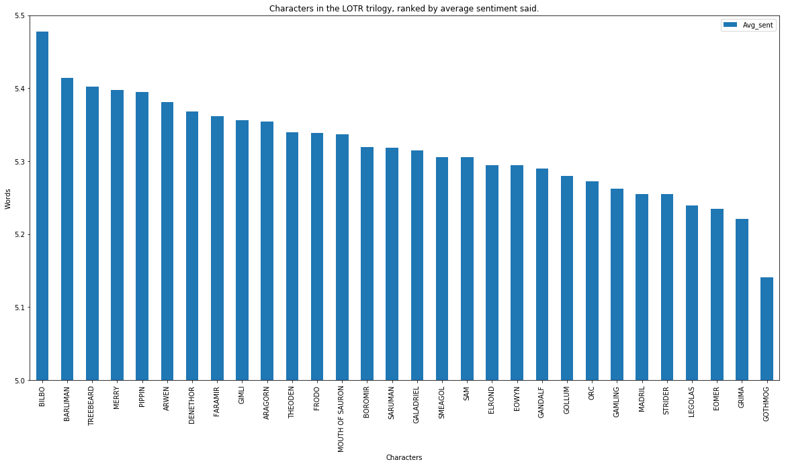
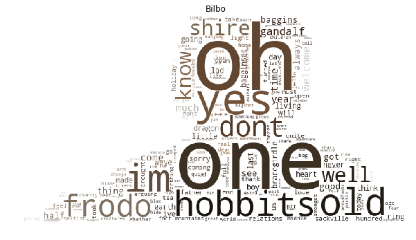
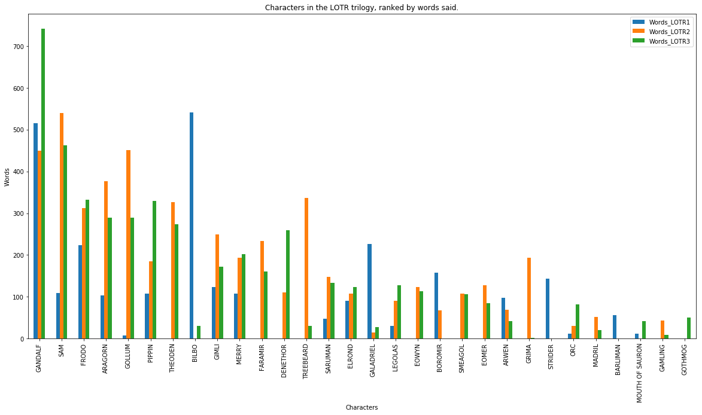

# Analyzing Lord of The Rings with Data Science

## Overview 

1. [Introduction](#1---introduction)
2. [Data](#2---data)
3. Networks
4. Basic Analysis
5. Community Detection
6. Text analysis and Sentiment analysis
7. More details

## 1 - Introduction 



## 2 - Data
We divided our analysis in three different ones, based on the datasets we had.

#### 1. The fan Wiki of Lord of The Rings

[Here's the link to the wiki](http://lotr.wikia.com/wiki/Main_Page) where we extracteed the content of all the wikipages from all the characters present in Lord Of the Rings story.

If you want to download the files containing the wikipages data [click here](https://github.com/Nab-88/social-graphs-and-interactions/blob/master/datasets/characters.zip). (You will have access to a .zip files containing a .txt file for each characters of the wiki.)

#### 2. Transcripts of the movie

We found a dataset, containing what the characters of the movies are saying. [Click here to have access to our trasncripts.](https://github.com/Nab-88/social-graphs-and-interactions/blob/master/datasets/lotr_scripts.csv)

#### 3. Books

We downloaded the three books from J.R.R Tolkien from [this website.](https://archive.org/)
Here you can download the books we used for our project.
- [Book 1 - The Fellowship of the Ring](https://github.com/Nab-88/social-graphs-and-interactions/blob/master/datasets/LOTR1_book_CLEAN.txt)
- [Book 2 - The Two Towers](https://github.com/Nab-88/social-graphs-and-interactions/blob/master/datasets/LOTR3_book_CLEAN.txt)
- [Book 3 - The Return of the King](https://github.com/Nab-88/social-graphs-and-interactions/blob/master/datasets/LOTR2_book_CLEAN.txt)

## 3 - Networks

#### 1. Network based on the link inside the wikipages

Nodes are the characters and edges are the link from the wikipage of one character to another one.

#### 2. Network based on the chapters of the books

We have created a network based on the books. Therefore, we look at each chapter and analyzed who were the characters in this chapter. If two characters are in the same chapter it means that they are connected, so there is a link between them.
That's how we build the network that you can see bellow:

## 4 - Basic Analysis 

### Wiki Network

| Degree | Eigenvector | Betweeness |
| ----------------:| -------:|-------:|
|Frodo (0.55)   | Sauron (0.33)       |Frodo (0.12)   | 
|Gandalf (0.44)  | Gandalf (0.311)       |Gandalf (0.089)	   |
|Saruman (0.37)   | Frodo (0.310)     |Eowyn (0.084)   | 
|Sauron (0.32)   | Elrond (0.27)      |Merry (0.066)   | 
|Merry (0.31)   | Gimli (0.26)    |Saruman (0.065)   |
|Pippin (0.30)   |  Legolas (0.249)       |Hàma (0.063)   |
|Legolas (0.27)  | Galadriel (0.246)     | Sam (0.06)       |
|Galadriel (0.26)   | Saruman (0.23)       |Gamling (0.058)   | 
|Sam (0.26)   | Gollum (0.18	)     |Grishnákh (0.051)    |
|Gimli (0.25)   | Sam (0.17)       |Théoden (0.051)| 

#### Degree:

> The degree centrality measures how a character is connected in the network.

So as we could expect Frodo is the most connected character (a degree of 0.54 means that Frodo is connected to 54% of the characters of the story).
Surprisingly Merry and Pippin are the 3rd and 4th most connected characters, it could be explain by the fact that during the story they have been seperated from the other members of the Fellowship of the Rings, and during this time alone, they are meeting with a lot of secondary characters.

#### Eigen Vector:

> The eigen vector centrality measures the influence of a character in the network.

#### Betweeness:

> The betweeness centrality measures how central is a character in the network. A character with high betweeness centrality would have more control over the network because a lot of information will pass through him.

#### Final Ranking

So in order to really know who are the most important characters in Lord of the Rings story. We create a competition between each characters.
Here's the podium:

  
Here's how we calculate the score:
Each centrality indicator ranking gives you points: 10 if you arrive first, 9 if you arrive second etc..
So the final score are:

Frodo = 28
Gandalf = 27 
Saruman = 17
Sauron = 17

## 5 - Community detection

Here we have to:
- Create community for the most relevant graph
- Analyse them and explain the results
- Create community based on race or culture
- Compare them
- And find the ties between community with cconfusion matrix

## 6 - Sentiment analysis

### 6.1 - Sentiment analysis over characters

We also wanted to know who are the nicest and badest guys in each book.

We performed a sentiment analysis over each book:

To summarize all the sentiments of the characters here is the ranking of the characters from the Nicest (on the left) to the baddest (on the right)

More generally, it appears that Bilbo is one of the nicest person in the Middle Earth and especially all the hobits like Merry and Pippin are nice persons. But this analysis confirms what we were expecting, that Orcs, Gothmog and Grima are really bad persons. 

But we also have some suprise like Saruman who is in th middle of the ranking which could be explain because in the beginning of the story is lying to Gandalf and faking to be a good magician.

We can see that the most words most frequently said by Saruman are : Burn, Sauron, Fire, War ...

### 6.2 - Evolution of sentiments over the books

Thanks to the sentiment analysis we performed we are able to know when are the darkest and the happiest time of the story

To perform the sentiment analysis, we used a database of 10.000 words of the English language, each word in this database is associated to its own sentimental score. Thanks to that, we are able to perform the sentimental analysis on chapters of the book or on what people are saying in the movies.

It is interesting to see that only 6 of the chapters have an average sentiment score higher than our database, meaning that in general the novels has a higher prevalence of words with a lower sentiment rating. However, note that the database we used has 10,222 words, while the number of words in the book is more than 500,000 words long, with multiple languages (Elvish and English) and a high number of words used infrequently in general in modern English.

-->include word cloud when gandalf dies <--

-->include word cloud when merry and pippin are back <--

### 6.3 - When a specific words is appearing in the story

This lexical dispersion plot shows at what times characters who speak the most in the Lord of the Rings movie trilogy are mentioned in the books. Note that for example Bilbo, who doesn't appear in the second movie, is mentioned a few times in the book. As well as that, we can see that Madril is a character who only appears in the movies, and not in the original novels.

## 7 - More details

If you are interested about how we come up to these results and you want to see our code you go check [this link to have access to our jupyter notebook.](http://nbviewer.jupyter.org/github/Nab-88/social-graphs-and-interactions/blob/master/notebook/final_version.ipynb)
