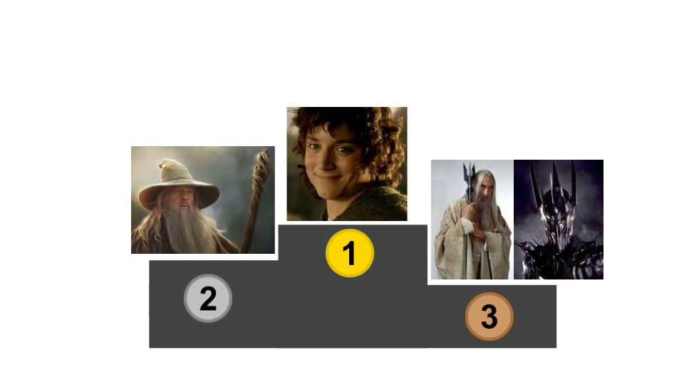
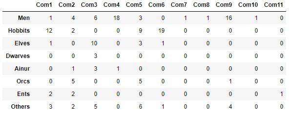
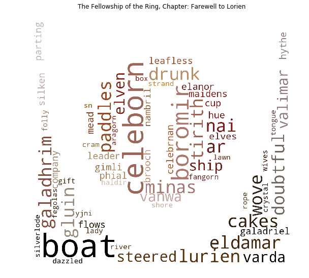
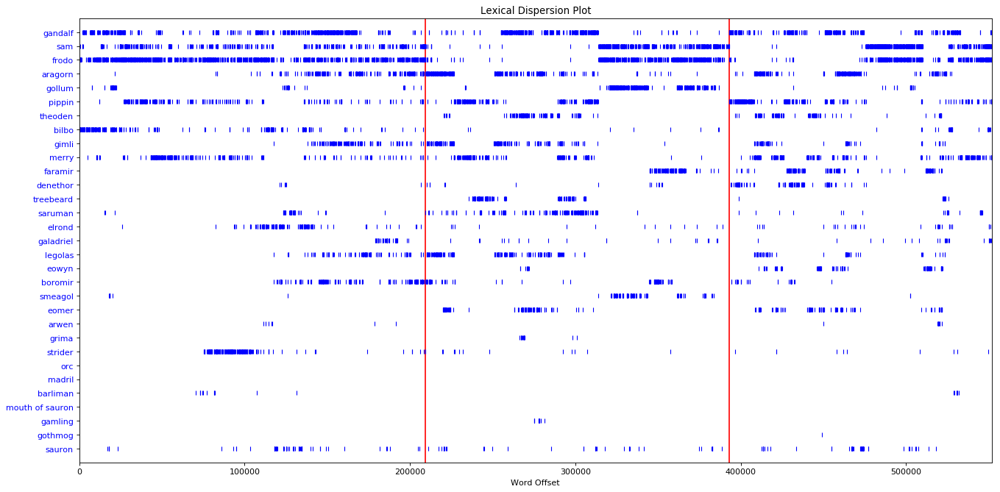

# Analyzing Lord of The Rings with Data Science

## Overview 

1. [Introduction](#1---introduction)
2. [Data](#2---data)
3. [Networks](#3---networks)
4. [Basic Analysis](#4---basic-analysis)
5. [Community Detection](#5---community-detection)
6. [Text analysis and Sentiment analysis](#6---sentiment-analysis-and-text-analysis)
7. [More details](#7---more-details)

## 1 - Introduction 



## 2 - Data
We divided our analysis in three different ones, based on the datasets we had.

#### 1. The fan Wiki of Lord of The Rings

[Here's the link to the wiki](http://lotr.wikia.com/wiki/Main_Page) where we extracteed the content of all the wikipages from all the characters present in Lord Of the Rings story.

If you want to download the files containing the wikipages data [click here](https://github.com/Nab-88/social-graphs-and-interactions/blob/master/datasets/characters.zip). (You will have access to a .zip files containing a .txt file for each characters of the wiki.)

#### 2. Transcripts of the movie

We found a dataset, containing what the characters of the movies are saying. [Click here to have access to our trasncripts.](https://github.com/Nab-88/social-graphs-and-interactions/blob/master/datasets/lotr_scripts.csv)

#### 3. Books

We downloaded the three books from J.R.R Tolkien from [this website.](https://archive.org/)
Here you can download the books we used for our project.
- [Book 1 - The Fellowship of the Ring](https://github.com/Nab-88/social-graphs-and-interactions/blob/master/datasets/LOTR1_book_CLEAN.txt)
- [Book 2 - The Two Towers](https://github.com/Nab-88/social-graphs-and-interactions/blob/master/datasets/LOTR3_book_CLEAN.txt)
- [Book 3 - The Return of the King](https://github.com/Nab-88/social-graphs-and-interactions/blob/master/datasets/LOTR2_book_CLEAN.txt)

## 3 - Networks

#### 1. Network based on the link inside the wikipages

Nodes are the characters and edges are the link from the wikipage of one character to another one.

#### 2. Network based on the chapters of the books

We have created a network based on the books. Therefore, we look at each chapter and analyzed who were the characters in this chapter. If two characters are in the same chapter it means that they are connected, so there is a link between them.
That's how we build the network that you can see bellow:

## 4 - Basic Analysis 

> For this section we decided to present the work we did on the Network obtained with the Wikipages.

| Degree | Eigenvector | Betweeness |
| ----------------:| -------:|-------:|
|Frodo (0.55)   | Sauron (0.33)       |Frodo (0.12)   | 
|Gandalf (0.44)  | Gandalf (0.311)       |Gandalf (0.089)	   |
|Saruman (0.37)   | Frodo (0.310)     |Eowyn (0.084)   | 
|Sauron (0.32)   | Elrond (0.27)      |Merry (0.066)   | 
|Merry (0.31)   | Gimli (0.26)    |Saruman (0.065)   |
|Pippin (0.30)   |  Legolas (0.249)       |Hàma (0.063)   |
|Legolas (0.27)  | Galadriel (0.246)     | Sam (0.06)       |
|Galadriel (0.26)   | Saruman (0.23)       |Gamling (0.058)   | 
|Sam (0.26)   | Gollum (0.18	)     |Grishnákh (0.051)    |
|Gimli (0.25)   | Sam (0.17)       |Théoden (0.051)| 

#### Degree:

> The degree centrality measures how a character is connected in the network.

So as we could expect Frodo is the most connected character (a degree of 0.54 means that Frodo is connected to 54% of the characters of the story).

Surprisingly Merry and Pippin are the 3rd and 4th most connected characters, it could be explain by the fact that during the story they have been seperated from the other members of the Fellowship of the Rings, and during this time alone, they are meeting with a lot of secondary characters.

#### Eigenvector:

> The eigen vector centrality measures the influence of a character in the network.

Unsurprisingly, Sauron is the most influent character of the story. Which can be explain because he is the person who created the Rings, so he's basically the Lord of the Rings.

Gollum is also appearing in the top 10 most influent characters of the story because he is playing a key role in the story when he helps Frodo to bring the Ring to Mordor.

One thing worth noticing, is that there is a lot of "wise" characters (Gandalf, Elrond, Galadriel, Saruman (even if he is bad)) in this top 10, because they have a lot of influence over other characters through the story.

#### Betweeness:

> The betweeness centrality measures how central is a character in the network. A character with high betweeness centrality would have more control over the network because a lot of information will pass through him.

Here Éowyn and Hàma are very high in the ranking even if they are secondary characters, because they are the link between and important characters and other characters for example Hàma is the right-hand of Théoden, so he has importance if you want to reach Théoden.

#### Final Ranking

So in order to really know who are the most important characters in Lord of the Rings story. We create a competition between each characters.

Here's the podium:

  
Here's how we calculate the score:
Each centrality indicator ranking gives you points: 10 if you arrive first, 9 if you arrive second etc..
So the final score are:

- Frodo = 28 points
- Gandalf = 27 points
- Saruman = 17 points and Sauron = 17 points

## 5 - Community detection

Here we have to:
- Create community for the most relevant graph
- Analyse them and explain the results
- Create community based on race or culture
- Compare them
- And find the ties between community with cconfusion matrix

| Community   1        | Community 2              | Community 3          | Community 4                 | Community 5             | Community 6               | Community 7              | Community 8 | Community 9                    | Community 10 | Community 11 |
|----------------------|--------------------------|----------------------|----------------------------|-------------------------|---------------------------|--------------------------|-------------|--------------------------------|--------------|--------------|
| Galdor of the Havens | Grishnákh                | Galadriel            | Hirluin                    | Rúmil (Noldo)           | Milo Burrows              | Fastred (Pelennor Fields | Herefara    | Théoden                        | Targon       | Beechbone    |
| Nob                  | Arod                     | Thranduil            | Bergil                     | Ufthak                  | Old Noakes                |                          |             | Wídfara                        |              |              |
| Peregrin Took        | Bill Ferny               | Gimli                | Forlong                    | Lagduf                  | Mrs. Proudfoot            |                          |             | Théodred                       |              |              |
| Farmer Maggot        | Gárulf                   | Dáin II Ironfoot     | Boromir                    | Samwise Gamgee          | Widow Rumble              |                          |             | Dúnhere                        |              |              |
| Frodo Baggins        | Saruman                  | Elladan and Elrohir  | Gandalf                    | Landroval               | Lotho Sackville-Baggins   |                          |             | Elfhelm                        |              |              |
| Old Man Willow       | Snaga (Grishnákh's band) | Mouth of Sauron      | Duilin                     | Meneldor                | Melilot Brandybuck        |                          |             | Éowyn                          |              |              |
| Bob                  | Willie Banks             | Haldir (Lorien)      | Ingold                     | Anborn                  | Lindir                    |                          |             | Herubrand                      |              |              |
| Treebeard            | Mat Heathertoes          | Grimbeorn            | Golasgil                   | Wilcombe (Jolly) Cotton | Will Whitfoot             |                          |             | Gothmog (Lieutenant of Morgul) |              |              |
| Rorimac Brandybuck   | Hasufel                  | Sauron               | Denethor II                | Rúmil of Lórien         | Daddy Twofoot             |                          |             | Erkenbrand                     |              |              |
| Fredegar Bolger      | Mauhúr                   | Éothain              | Beregond (Captain)         | Snaga                   | Sancho Proudfoot          |                          |             | Ceorl                          |              |              |
| Tom Bombadil         | Éomer                    | Glóin                | Baranor (Gondor)           | Carl Cotton             | Otho Sackville-Baggins    |                          |             | Witch-king's Fellbeast         |              |              |
| Bregalad             | Finglas                  | Glorfindel           | Dervorin                   | Mablung the Ranger      | Bilbo Baggins             |                          |             | Gléowine                       |              |              |
| Meriadoc Brandybuck  | Uglúk                    | Erestor              | Imrahil                    | Tolman Cotton           | Everard Took              |                          |             | Gamling                        |              |              |
| Fimbrethil           | Lugdush                  | Durin's Bane         | Ioreth                     | Robin Smallburrow       | Bruno Bracegirdle         |                          |             | Witch-king of Angmar           |              |              |
| Goldberry            | Hob Hayward              | Círdan               | Angbor                     | Orophin                 | Lobelia Sackville-Baggins |                          |             | Harding                        |              |              |
| Ted Sandyman         |                          | Elrond               | Faramir                    | Damrod                  | Dora Baggins              |                          |             | Ghân-buri-Ghân                 |              |              |
| Barliman Butterbur   |                          | Beorn                | Derufin                    | Gorbag                  | Odo Proudfoot             |                          |             | Grimbold                       |              |              |
| Watcher in the Water |                          | Asfaloth             | Hurin (Warden of the Keys) | Bowman Cotton           | Hamfast Gamgee            |                          |             | Déorwine                       |              |              |
| Folco Boffin         |                          | Arwen                | Duinhir                    | Gwaihir                 | Angelica Baggins          |                          |             | Windfola                       |              |              |
|                      |                          | Aragorn II Elessar   |                            | Déagol                  | Adelard Took              |                          |             | Háma                           |              |              |
|                      |                          | Halbarad             |                            | Shagrat                 | Hugo Bracegirdle          |                          |             | Gríma Wormtongue               |              |              |
|                      |                          | Celeborn             |                            | Rosie Cotton            |                           |                          |             |                                |              |              |
|                      |                          | Firefoot             |                            | Radbug                  |                           |                          |             |                                |              |              |
|                      |                          | Legolas              |                            | Gollum                  |                           |                          |             |                                |              |              |
|                      |                          | Gildor Inglorion     |                            | Muzgash                 |                           |                          |             |                                |              |              |
|                      |                          | The King of the Dead |                            | Shelob                  |                           |                          |             |                                |              |              |
|                      |                          | Radagast             |                            |                         |                           |                          |             |                                |              |              |

#### Confusion Matrix

## 6 - Sentiment analysis and Text Analysis

### 6.1 - Sentiment analysis over characters

For the characters we performed a sentimental analysis over each of their lines in the movies and calculated the score. 

High score indicated that Bilbo, Barliman and Treebeard were the nicest people throughout the movies. Other hobbits such as Merry and Pippin also score highly. It was surprising for us to see Legolas ranked fourth from bottom, but we believe that his frequent involvement in battles contributed with his low scores. Eomer is ranked lower than him, at the bottom, confirming our expectations of evil persons, we can see the two of Gríma and Gothmog, who are evil characters.

Some other surprising results show Saruman in the middle of the pack, but in the beginning of the movie he played a good guy when speaking to Gandalf, raising his score.

Below we can see wordclouds for Bilbo and Saruman

### 6.2 - Evolution of sentiments over the books

Thanks to the sentiment analysis we performed we are able to know when the darkest and happiest time of the story occur.

To perform the sentiment analysis, we used a database of a little more than 10.000 English words, each word in this database is associated to its own sentimental score. Thanks to that, we are able to perform the sentimental analysis on chapters of the book or on what people are saying in the movies.

It is interesting to see that only 6 of the chapters have an average sentiment score higher than our database, meaning that in general the novels has a higher prevalence of words with a lower sentiment rating. However, note that the database we used has 10,222 words, while the number of words in the book is more than 500,000 words long, with multiple languages (Elvish and English) and a high number of words used infrequently in general in modern English.

#### 6.2.1 - Wordclouds of the highest and lowest sentiment scoring chapters.

The chapter with the worst sentiment ranking is The Bridge of Khazad-dum in the first novel. In the wordcloud one can see words such as 'hacked', 'blade', and 'axe'. Clearly indicating a battle. One who has either read the novels or seen the movies will know more about what's happening based on the words. 

The chapter with the highest sentiment ranking is Farewell to Lorien, also in the first novel. In addition to some elvish words, we can see 'cakes' and 'drunk' in the cloud, indicatiang some sort of party.

Wordclouds for every single chapter are included in the appendix of the notebook. People who might not have time to read the whole book can possibly get the gist of what's happening in throughout the book simply by viewing the wordclouds.

### 6.3 - When a specific words is appearing in the story

This lexical dispersion plot shows at what times characters who speak the most in the Lord of the Rings movie trilogy are mentioned in the books. Note that for example Bilbo, who doesn't appear in the second movie, is mentioned a few times in the book. As well as that, we can see that Madril is a character who only appears in the movies, and not in the original novels.

## 7 - More details

If you are interested about how we came up to these results and you want to see our code you ca, check [this link to have access to our Explainer Notebook.](http://nbviewer.jupyter.org/github/Nab-88/social-graphs-and-interactions/blob/master/notebook/final_version.ipynb)
